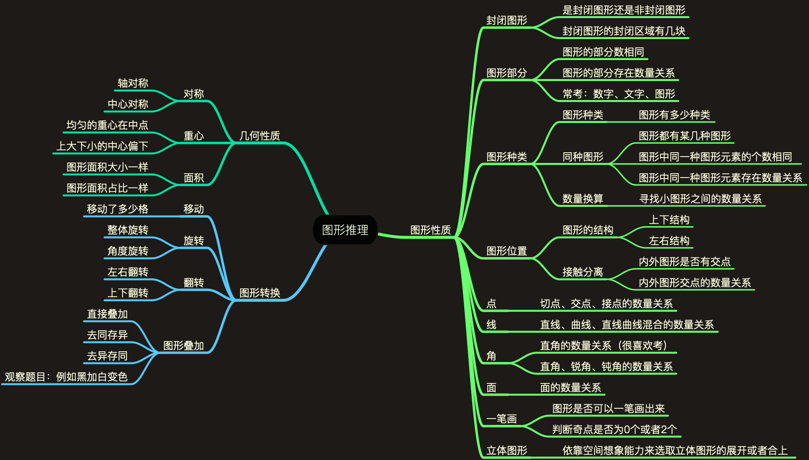

# 图形推理

## 思维导图

## 常考题型

### 类比推理

* 常考知识：图形构成、几何性质。
* 题目类型：两组图形，每组三个图形，需要根据第一组图形推导第二组图形。

### 顺推推理

* 常考知识：图形构成、图形转化。
* 解题思路：共同特征、连续变化、图形间隔排序、中间位置对称。
* 题目类型：给出一组图形，观察图形规律推理答案。

### 九宫格推理

* 常考知识：图形构成、几何性质、图形转化。
* 解题思路：把图形分为三组进行对比观察。
* 题目类型：在九宫格中给出八个图片，推理出所缺图片。

### 空间推理

* 常考知识：图形构成。
* 解题思路：根据图形的定点来进行空间想象。
* 题目类型：立体图形展开、平面图形折叠。

## 解题思路

* 可以多个图形推理题一起观察。
* 题目一般不会考重复的知识点。
* 数点、线、面比较费时放后面。