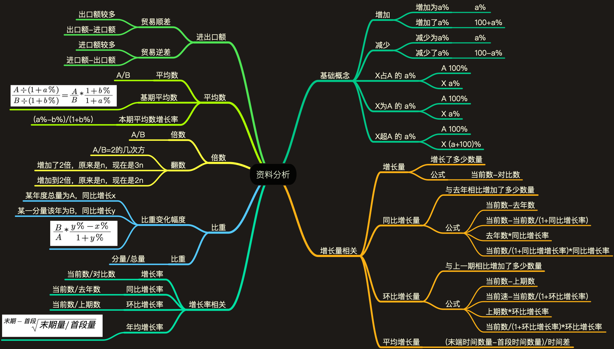

# 资料分析

## 思维导图

## 解题技巧

### 原因

* 资料分析计算数值常常较大。
* 计算出具体结果较为花费时间。
* 利用技巧和选项答案快速进行计算。

### 尾数法

* 加/减/乘计算
* 直接计算尾数
* 对比答案选择

### 首数法

* 加/减/除计算
* 直接计算首数
* 对比答案选择
* 注意借位和进位

### 有效数字

* 不利于计算的数字，例如 1.479
* 可以对其进行相似值替换
* 规则为对第一位四舍五入
* 所以 1.479 可以当做 1.5 计算

### 数字替换法

* 根据表格将不易计算的小数化为分数

| - | - | - | - | - |
| --- | --- | --- | --- | --- |
| 0.5 = 1/2 | 0.33 = 1/3 | 0.66 = 2/3 | 0.25 = 1/4 | 0.75 = 3/4 |
| 0.2 = 1/5 | 0.4 = 2/5 | 0.6 = 3/5 | 0.8 = 4/5 | 0.167 = 1/6 |
| 0.143 = 1/7 | 0.125 = 1/8 | 0.375 = 3/8 | 0.625 = 5/8 | 0.875 = 6/8 |
| 0.111 = 1/9 | 0.222 = 2/9 | 0.444 = 4/9 | 0.555 = 5/9 | 0.777 = 7/9 |